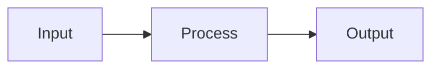

# MkDocs Material Optimization — Skill Guide

Transform plain markdown into rich, well-structured documentation. This skill covers **structural optimization** (metadata, headings, navigation) and **visual enhancement** (admonitions, tabs, Mermaid, grid cards).

## Priority Order (structural first, visual second)

1. **Metadata**: Every page needs YAML front matter (title, description, tags)
2. **Heading consistency**: Fix leftover section numbers from document splitting
3. **Navigation config**: Enable key `theme.features` and plugins in `mkdocs.yml`
4. **TL;DR summaries**: Long pages (>60 lines) get `!!! abstract` at the top
5. **Visual components**: Admonitions, tabs, Mermaid, grid cards
6. **Verify**: Build test or spot-check rendered output

---

## Prerequisites — mkdocs.yml Configuration

### Required Markdown Extensions

```yaml
markdown_extensions:
  - admonition
  - pymdownx.details
  - pymdownx.superfences:
      custom_fences:
        - name: mermaid
          class: mermaid
          format: !!python/name:pymdownx.superfences.fence_code_format
  - pymdownx.highlight:
      anchor_linenums: true
  - pymdownx.inlinehilite
  - pymdownx.tabbed:
      alternate_style: true
  - pymdownx.arithmatex:
      generic: true
  - pymdownx.emoji:
      emoji_index: !!python/name:material.extensions.emoji.twemoji
      emoji_generator: !!python/name:material.extensions.emoji.to_svg
  - attr_list
  - md_in_html
  - tables
  - footnotes
  - toc:
      permalink: true
```

> Note: `!!python/name:` YAML tags trigger LSP errors in editors but are valid MkDocs syntax at runtime.

> **Mermaid theming caveat**: With `class: mermaid`, Material overrides all Mermaid colors via shadow DOM. For custom colors, use the custom integration in [Section 2.3](#23-mermaid-diagrams--custom-theming).

### Recommended Theme Features

Many projects miss these high-value features. Check and add as needed:

```yaml
theme:
  features:
    - navigation.tabs          # top-level sections as tabs
    - navigation.sections      # bold section headers in sidebar
    - navigation.expand        # auto-expand sidebar sections
    - navigation.top           # back-to-top button
    - navigation.footer        # previous/next page links at bottom
    - navigation.path          # breadcrumb trail (e.g. Post-Training > Ch1 > GRPO)
    - navigation.instant        # SPA mode — no full page reload
    - navigation.instant.progress  # top loading bar during navigation
    - search.suggest
    - search.highlight
    - content.code.copy
    - content.code.annotate
```

| Feature | Impact | When Essential |
|---------|--------|----------------|
| `navigation.footer` | High | Linear reading flow (chapter → chapter) |
| `navigation.path` | High | Deep nesting (3+ levels) |
| `navigation.instant` | Medium | Any site — faster page transitions |
| `content.code.copy` | Medium | Code-heavy documentation |

### Recommended Plugins

```yaml
plugins:
  - search
  - tags        # enables tag-based cross-page navigation
```

The `tags` plugin reads `tags:` from each page's front matter and renders tag chips on pages. No extra config needed for basic usage.

### .gitignore

Ensure `site/` is in `.gitignore` — the `site/` directory is a build artifact that should not be committed:

```
site/
```

---

## 1. Structural Optimization (do this before visual work)

### 1.1 YAML Front Matter

Every content page MUST have front matter. Without it, page titles degrade to filenames, social cards have no content, and tags don't work.

```yaml
---
title: GRPO — RLVR 奠基算法
description: Group Relative Policy Optimization 的核心机制、公式推导与工程实践
tags:
  - GRPO
  - RLVR
  - DeepSeek
---
```

Rules:
- `title`: Use the H1 heading text (with or without the section number prefix)
- `description`: One natural sentence summarizing the page
- `tags`: 2–4 relevant keywords; reuse tags across pages for cross-navigation
- Index pages that already have front matter: add `tags` if missing

### 1.2 Post-Split Heading Cleanup

When a large document is split into multiple files, leftover section numbers in headings cause confusion. This is the **most common structural issue**.

**Pattern to detect**: File is named `1.2-xxx.md` but contains headings like `## 2.1 ...`, `### 3.2 ...` — these "2.1" and "3.2" are remnants from the original document's structure.

**Fix**: Remove the numeric prefix, keep the descriptive text.

| Before | After |
|--------|-------|
| `## 2.1 RLHF 范式：从人类反馈中学习` | `## RLHF 范式：从人类反馈中学习` |
| `### 3.2 SeeUPO — 首个多轮收敛保证` | `### SeeUPO — 首个多轮收敛保证` |

**What to keep**: The H1 section number that matches the filename (e.g. `# 1.2 奖励信号` in `1.2-reward.md` is correct).

**Audit method**: For each file, compare the filename number (e.g. `1.2`) against H2/H3 heading numbers. Any mismatch (e.g. `## 2.1` in a `1.2-*.md` file) is a leftover that needs removal.

### 1.3 TL;DR Placement Strategy

For pages >60 lines, add an abstract admonition right after the H1 heading:

```markdown
# Page Title

!!! abstract "本节摘要"
    1-3 sentence summary of this page's key content.

!!! info "研究范围"
    Existing metadata admonition...
```

Placement rules:
- TL;DR goes **immediately after H1**, before any existing admonitions
- If the page already opens with a concise summary paragraph or an `!!! info` that serves as a summary, skip the TL;DR to avoid redundancy
- Keep summaries to 1–3 sentences; they should help readers decide whether to read further

---

## 2. Visual Components

### 2.1 Admonitions — The Core Visual Tool

Admonitions transform flat text into color-coded, semantically meaningful callout boxes.

**Syntax forms:**

```markdown
!!! type "Custom Title"        # always open
    Content (4-space indent).

??? type "Custom Title"        # collapsible, closed by default
    Content (4-space indent).

???+ type "Custom Title"       # collapsible, open by default
    Content (4-space indent).
```

**Available types and semantic meaning:**

| Type | Color | Use For |
|------|-------|---------|
| `note` | Blue-grey | General notes, neutral information |
| `info` | Blue | Scope definitions, metadata, background context |
| `tip` | Green-teal | Recommendations, conclusions, navigation guides |
| `success` | Green | Strengths, key insights, positive findings |
| `warning` | Orange | Limitations, caveats, disclaimers |
| `danger` | Red | Anti-patterns, things to avoid |
| `example` | Purple | Case studies, illustrative scenarios |
| `quote` | Light grey | Notable quotes, philosophical conclusions |
| `abstract` | Blue-green | TL;DR summaries, citations, references |
| `question` | Green-teal | Open questions, discussion points |
| `failure` | Red | Failed approaches |

**Content rules:**
- **4-space indent** on every line inside the admonition
- **Blank line** before the admonition and after its last line of content
- **Arrow characters**: Use `--` instead of `→` inside admonitions to avoid rendering issues
- **Code blocks inside**: 4-space indent before the backticks
- Use at most **1–2 admonitions per screen**; do not wrap every paragraph

### 2.2 Content Tabs — Parallel/Alternative Content

Use tabs for true parallels (2–5 options). Never create a single tab.

```markdown
=== "Option A"
    Content for A (4-space indent).

=== "Option B"
    Content for B.
```

| Scenario | Example |
|----------|---------|
| Architectural patterns | `=== "Pattern 1: Router"` / `=== "Pattern 2: Agent"` |
| Language comparisons | `=== "Python"` / `=== "JavaScript"` |
| Tier-based content | `=== "Tier 1: Near-term"` / `=== "Tier 2: Mid-term"` |
| Platform-specific | `=== "macOS"` / `=== "Linux"` / `=== "Windows"` |

**Content rules:**
- 4-space indent for all content inside tabs
- Blank line between the end of one tab's content and the next `===`
- Avoid nesting tabs inside admonitions (requires 8-space indent, error-prone)

### 2.3 Mermaid Diagrams — Custom Theming

#### Basic syntax

````markdown

````

**Common types:**

| Type | Direction | Use For |
|------|-----------|---------|
| `flowchart LR` | Left → Right | Architecture / system diagrams |
| `flowchart TD` | Top → Down | Process / decision flows |
| `sequenceDiagram` | — | Request/response interactions |

**Core principle: diagrams must carry information that text alone cannot efficiently convey.** "简洁大方" refers to visual styling (colors, shapes), NOT to stripping information from labels. A diagram with rich, informative labels and clean styling is the goal.

**When to draw a diagram vs. use text:**

| Draw a diagram | Use text instead |
|----------------|-----------------|
| Branching/merging logic (A→B, A→C) | Linear sequence (A→B→C) with ≤4 nodes and no branching |
| Parallel/concurrent structures | Simple enumeration that a bullet list covers |
| Feedback loops or cyclic dependencies | One-directional flow already described in prose |
| Subgraph groupings that show system architecture | Trivial groupings with no structural insight |

**If a diagram is just a linear chain of 3-4 nodes with no branching, and the surrounding text already says the same thing — delete the diagram.** It adds visual noise without information value.

**Syntax best practices:**
- `-->` solid, `-.->` dashed, `==>` thick arrows
- `{Decision}` for diamond decision nodes; `([...])` for start/end
- Wrap labels in double quotes if they contain special characters
- Node labels should be **informative** (include key mechanism/metric), not just category names
- Edge labels should carry **causal reasons** ("why this transition"), not just "next step"

**Pitfalls to avoid (learned from production):**

| Pitfall | Problem | Solution |
|---------|---------|----------|
| Emoji in node labels | Rendering breaks on some browsers/Mermaid versions | Use plain text only |
| HTML tags in nodes | `<b>`, `<br>` depend on SVG foreignObject, unreliable | Use `\n` for line breaks instead |
| Over-simplified labels | "DAPO" alone tells reader nothing | Add mechanism: `"DAPO\n非对称裁剪 + 动态采样"` |
| Trivial linear chains | 3-node A→B→C duplicates surrounding text | Delete diagram, keep text |

#### CRITICAL: Material's Mermaid CSS Override Problem

Material wraps Mermaid in **shadow DOM** and injects CSS that **overrides all theme settings**. `%%{init}%%` directives, `extra.css`, and `!important` are all ineffective. Symptoms: gray subgraph backgrounds, unchangeable node colors.

Confirmed by squidfunk in [#5681](https://github.com/squidfunk/mkdocs-material/issues/5681) and [#4582](https://github.com/squidfunk/mkdocs-material/discussions/4582).

#### Solution: Custom Mermaid Integration

Bypass Material's CSS by using a different fence class + your own Mermaid JS initialization. Three changes required:

1. **Create `docs/javascripts/mermaid.mjs`** — imports Mermaid from CDN, calls `mermaid.initialize()` with your palette, renders `.mermaid-custom` elements. For the full template with 3 preset palettes (indigo/teal/neutral), see [mermaid-reference.md](mermaid-reference.md).

2. **Update `mkdocs.yml`** — change fence class and add JS:
    ```yaml
    custom_fences:
      - name: mermaid
        class: mermaid-custom       # NOT "mermaid" — bypasses Material CSS
        format: !!python/name:pymdownx.superfences.fence_code_format
    extra_javascript:
      - javascripts/mermaid.mjs     # must be listed
    ```

3. **Add CSS** in `extra.css` for `.mermaid-custom` (centering + responsive width).

4. **Clean up** — remove all `%%{init}%%` directives from markdown. Theme is now global via JS.

Key themeVariables for the subgraph gray-background fix: `clusterBkg` and `clusterBorder` (not `tertiaryColor`).

#### Diagram design best practices

| Principle | Bad | Good |
|-----------|-----|------|
| Information density | Bare labels: `DAPO`, `GRPO` | Informative: `"DAPO\n非对称裁剪 + 动态采样"` |
| Edge labels | Empty or generic (`"next"`) | Causal: `"Critic 训练困难\n4 模型显存过高"` |
| Node shapes | All rectangles `[...]` | Semantic: `([...])` start/end, `{...}` decision |
| Subgraphs | Flat list of nodes | Group related steps with `subgraph` |
| When to use TD vs LR | Always TD (tall) | TD for pipelines with many stages; LR for architecture/comparison |
| Trivial diagrams | Draw A→B→C for everything | Delete if ≤4 linear nodes and text already covers it |

### 2.4 Grid Cards — Navigation Pages

Grid cards create a visual card layout for index/landing pages.

```markdown
<div class="grid cards" markdown>

-   :material-flask:{ .lg .middle } **Card Title**

    ---

    Description text for this card.

    [:octicons-arrow-right-24: Link Text](./path/to/page.md)

-   :material-robot:{ .lg .middle } **Card Title 2**

    ---

    Another description.

    [:octicons-arrow-right-24: Link Text](./path/to/page2.md)

</div>
```

**Rules:**
- Requires `attr_list` and `md_in_html` extensions
- The `markdown` attribute on the `<div>` is required
- **Always use `{ .lg .middle }` modifier** on icons for consistent sizing and vertical alignment
- Keep card count reasonable (2–12); beyond 12, use a table or list instead
- Grid cards are best for index/landing pages, not regular content

**Consistency check:** If the main index uses `{ .lg .middle }`, all sub-index pages must use it too.

---

## 3. Decision Tree — What To Optimize

### 3.1 Structural Issues (check first)

| Issue | Detection | Action |
|-------|-----------|--------|
| Missing front matter | File doesn't start with `---` | Add title + description + tags |
| Leftover heading numbers | H2/H3 number doesn't match filename | Remove numeric prefix |
| Missing navigation features | `mkdocs.yml` lacks footer/path/instant | Add to theme.features |
| `site/` committed to git | `site/` directory in repo | Add to .gitignore |
| No tags plugin | `plugins:` section lacks `tags` | Add `- tags` to plugins |

### 3.2 Content Transformation Rules

| Current Content | Transform To |
|----------------|-------------|
| Blockquote TL;DR / summary | `!!! abstract "TL;DR"` |
| Blockquote citation | `??? abstract "Citation"` (collapsible) |
| Blockquote warning | `!!! warning "Title"` |
| "Key Insights" / "Findings" section | `!!! success "Key Insights"` |
| "Limitations" / "Weaknesses" section | `!!! warning "Limitations"` |
| "Recommendations" section | `!!! tip "Recommendations"` |
| "Avoid" / anti-pattern section | `!!! danger "Not Recommended"` |
| Numbered patterns (1, 2, 3) | Content tabs `=== "Pattern 1: Name"` |
| Plain link lists (index pages) | Grid cards with icons |
| ASCII box-and-arrow art | `mermaid flowchart LR/TD` |

---

## 4. Workflow — Optimizing a Doc Site

### Step 1: Audit

1. List all markdown files and line counts
2. Read `mkdocs.yml` — check extensions, theme.features, plugins
3. Check `.gitignore` for `site/`
4. Identify files lacking front matter (`grep -L '^---$' docs/**/*.md`)

### Step 2: Plan by Priority

| Priority | Task |
|----------|------|
| P0 | Fix mkdocs.yml (features + plugins + Mermaid integration) |
| P1 | Add front matter to all content pages; fix heading numbering |
| P2 | Add TL;DR to long pages (>60 lines); fix Grid Card consistency |
| P3 | Convert blockquotes to admonitions; parallel content to tabs |

### Step 3: Apply

For 10+ file sites, batch by directory (all `ch1/` files together, etc.). Per file: front matter → headings → TL;DR → visual. Edit `mkdocs.yml` and index pages separately.

### Step 4: Verify & Deploy

- If mkdocs installed: `mkdocs build --strict`
- Otherwise: spot-check key files, push to trigger CI build

---

## 5. Common Pitfalls

| Pitfall | Solution |
|---------|----------|
| Content not rendered inside admonition | Check 4-space indentation on every line |
| Tabs not rendering | Ensure `pymdownx.tabbed` with `alternate_style: true` |
| Mermaid not rendering | Ensure `pymdownx.superfences` with mermaid custom_fences |
| Emoji in Mermaid nodes | Remove emoji; use plain text labels only |
| `<b>` / HTML in Mermaid nodes | Remove HTML; shorten labels or use surrounding text |
| Arrow `→` breaks admonition | Use `--` or `-->` instead of the unicode arrow |
| Collapsible not working | Use `???` not `!!!`; ensure `pymdownx.details` is enabled |
| Grid cards not rendering | Ensure `attr_list` + `md_in_html`; `markdown` attr on div |
| Grid card icons inconsistent size | Always use `{ .lg .middle }` modifier on icons |
| Missing front matter | Page title defaults to filename; tags don't work |
| Heading numbers from doc splitting | Compare filename number against H2/H3 numbers; remove mismatches |
| `site/` committed to git | Add `site/` to `.gitignore` |
| `!!python/name:` LSP errors | Ignore — valid MkDocs syntax, editor false positive |
| TL;DR placed after existing admonitions | Place `!!! abstract` immediately after H1, before other admonitions |
| No previous/next links at page bottom | Add `navigation.footer` to theme.features |
| No breadcrumb for deep nesting | Add `navigation.path` to theme.features |
| **Mermaid colors/backgrounds won't change** | Material shadow DOM overrides all theme settings. `%%{init}%%` and `extra.css` are ineffective. Use custom integration (`class: mermaid-custom` + `mermaid.mjs`). See [Section 2.3](#23-mermaid-diagrams--custom-theming) and [mermaid-reference.md](mermaid-reference.md) |
| Mermaid diagram has no value | If ≤4 linear nodes and text says the same thing, **delete the diagram**. "简洁" means clean styling, not stripping information |

---

## 6. Quick Reference — Copy-Paste Templates

### Front Matter
```yaml
---
title: Page Title Here
description: One-sentence summary of this page.
tags:
  - Tag1
  - Tag2
---
```

### Admonition (standard)
```markdown
!!! info "Title"
    Content here.
```

### Admonition (collapsible, closed)
```markdown
??? abstract "Citation: Author (Year)"
    Citation details here.
```

### Other Templates

**TL;DR**: `!!! abstract "本节摘要"` with 4-space indented content.

**Tabs**: `=== "Option A"` / `=== "Option B"` with 4-space indented content.

**Mermaid**: Node shapes: `[...]` rect, `([...])` stadium, `{...}` diamond. For custom theming, see [mermaid-reference.md](mermaid-reference.md).

**Grid Cards**: Use `{ .lg .middle }` on icons. Requires `attr_list` + `md_in_html`.
