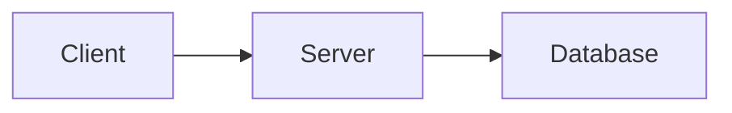
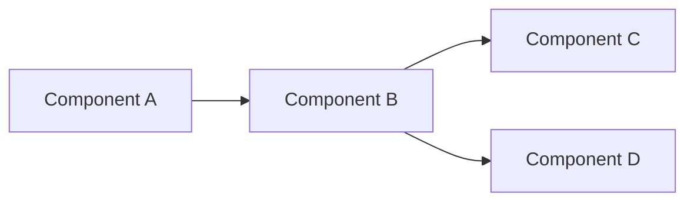
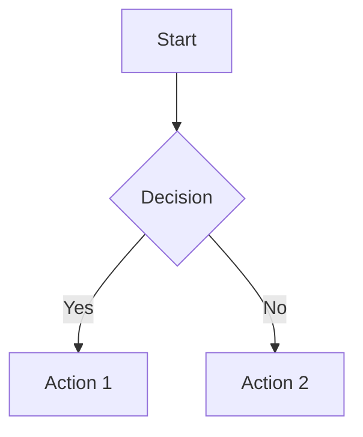
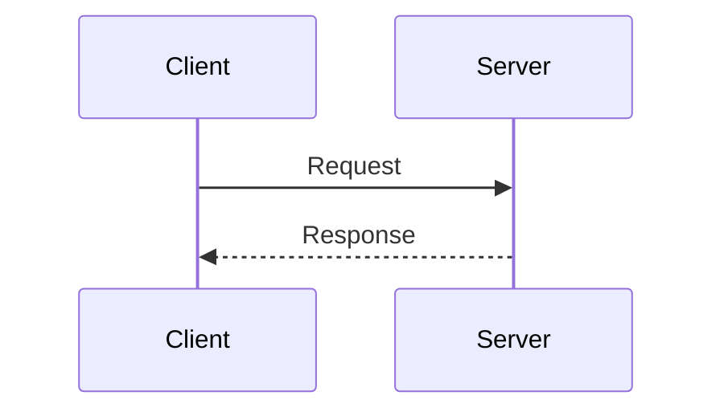
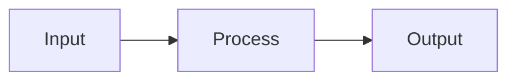

# MkDocs Material Visual Optimization — Skill Guide

Transform plain markdown into rich, visually structured documentation using MkDocs Material theme components. This skill covers what content can be optimized, what components are available, and best practices for applying them.

## Prerequisites — Required mkdocs.yml Extensions

Before any visual optimization, ensure these extensions are enabled in `mkdocs.yml`:

```yaml
markdown_extensions:
  - admonition                    # admonition blocks
  - pymdownx.details              # collapsible admonitions
  - pymdownx.superfences:         # fenced code blocks + mermaid
      custom_fences:
        - name: mermaid
          class: mermaid
          format: !!python/name:pymdownx.superfences.fence_code_format
  - pymdownx.tabbed:              # content tabs
      alternate_style: true
  - attr_list                     # required for grid cards
  - md_in_html                    # required for grid cards
  - tables                        # enhanced tables
  - pymdownx.emoji:               # Material icons
      emoji_index: !!python/name:material.extensions.emoji.twemoji
      emoji_generator: !!python/name:material.extensions.emoji.to_svg
```

> Note: `!!python/name:` YAML tags trigger LSP errors in editors but are valid MkDocs syntax at runtime. Ignore these warnings.

---

## 1. Admonitions — The Core Visual Tool

Admonitions transform flat text into color-coded, semantically meaningful callout boxes.

### 1.1 Syntax Forms

**Standard (always open):**
```markdown
!!! type "Custom Title"
    Content goes here.
    All content must be indented 4 spaces.
```

**Collapsible (closed by default):**
```markdown
??? type "Custom Title"
    Content goes here. Click to expand.
```

**Collapsible (open by default):**
```markdown
???+ type "Custom Title"
    Content goes here. Already expanded, can be collapsed.
```

### 1.2 Available Types and Their Semantic Meaning

| Type | Color | Use For |
|------|-------|---------|
| `note` | Blue-grey | General notes, neutral information |
| `info` | Blue | Scope definitions, metadata, background context |
| `tip` | Green-teal | Navigation guides, recommendations, conclusions, selection advice |
| `success` | Green | Strengths, key insights, positive findings, recommended practices |
| `warning` | Orange | Limitations, caveats, disclaimers, items needing evaluation |
| `danger` | Red | Anti-patterns, not-recommended items, things to avoid |
| `example` | Purple | Academic dilemmas, case studies, illustrative scenarios |
| `quote` | Light grey | Core insights, philosophical conclusions, notable quotes |
| `abstract` | Blue-green | Citations, references, TL;DR summaries, academic sources |
| `bug` | Red-pink | Known bugs, error conditions |
| `question` | Green-teal | Open questions, discussion points |
| `failure` | Red | Failed approaches, things that don't work |

### 1.3 Content Rules Inside Admonitions

- **4-space indent**: All content inside an admonition MUST be indented exactly 4 spaces
- **Arrow characters**: Use `--` instead of the right arrow character inside admonitions to avoid rendering issues
- **Blank lines**: Add a blank line before the admonition and after its content
- **Nested content**: Lists, code blocks, and other markdown work inside admonitions (with proper indentation)
- **Code blocks inside admonitions**: Need 4-space indent + the normal fence — total 4 spaces before the backticks

```markdown
!!! example "Code Inside Admonition"
    Here is some code:

    ```python
    print("hello")
    ```

    And a list:

    - Item one
    - Item two
```

---

## 2. Content Tabs — Parallel/Alternative Content

Use content tabs when you have parallel categories of information (e.g., multiple patterns, multiple languages, multiple tiers).

### 2.1 Syntax

```markdown
=== "Tab Label 1"
    Content for tab 1.
    Must be indented 4 spaces.

=== "Tab Label 2"
    Content for tab 2.
```

### 2.2 When to Use Content Tabs

| Scenario | Example |
|----------|---------|
| Architectural patterns | `=== "Pattern 1: Router"`, `=== "Pattern 2: Agent"` |
| Language comparisons | `=== "Python"`, `=== "JavaScript"` |
| Security/deployment models | `=== "Model 1: Sandbox"`, `=== "Model 2: OAuth"` |
| Tier-based predictions | `=== "Tier 1: Near-term"`, `=== "Tier 2: Mid-term"` |
| Audience-specific recs | `=== "For Academia"`, `=== "For Industry"` |
| Platform-specific instructions | `=== "macOS"`, `=== "Linux"`, `=== "Windows"` |

### 2.3 Content Rules Inside Tabs

- **4-space indent**: All content inside tabs MUST be indented 4 spaces
- **Code blocks inside tabs**: Need 4-space indent + fence — total 4 spaces before backticks
- **Blank line between tabs**: Always have a blank line between the end of one tab's content and the next `===`
- **Tabs inside admonitions**: Possible but needs 8-space total indent (4 for admonition + 4 for tab content). Generally avoid this complexity.

---

## 3. Mermaid Diagrams — Replace ASCII Art

Convert ASCII/text-based architecture diagrams to Mermaid for proper rendering.

### 3.1 Syntax

````markdown

````

### 3.2 Common Diagram Types

**Flowchart (horizontal — architecture overviews):**


**Flowchart (vertical — process flows):**


**Sequence diagram (interactions):**


### 3.3 Mermaid Best Practices

- Use `LR` (left-right) for architecture/system diagrams
- Use `TD` (top-down) for process/flow diagrams
- Keep node labels short — use subgraphs for grouping
- Use `-->` for solid arrows, `-.->` for dashed, `==>` for thick
- Use `{Decision}` for diamond decision nodes
- Avoid special characters in node labels that Mermaid doesn't support; wrap labels in quotes if needed

---

## 4. Grid Cards — Navigation Pages

Grid cards create a visual card layout for index/landing pages.

### 4.1 Syntax

```markdown
<div class="grid cards" markdown>

- :material-icon-name: **Card Title**

    ---

    Description text for this card.

    [:octicons-arrow-right-24: Link Text](./path/to/page.md)

- :material-icon-name: **Card Title 2**

    ---

    Another description.

    [:octicons-arrow-right-24: Link Text](./path/to/page2.md)

</div>
```

### 4.2 Rules

- Requires `attr_list` and `md_in_html` extensions
- The `markdown` attribute on the div is required for markdown rendering inside
- Each card is a list item (`- `) with icon, title, separator (`---`), description, and link
- Use Material Design Icons (`:material-*:`) or Octicons (`:octicons-*:`)
- Grid cards are best for index pages, not for regular content pages

---

## 5. Decision Tree — What To Optimize

Use this decision tree when scanning a markdown file for optimization opportunities:

### 5.1 Blockquotes (`>`)

| Current Content | Transform To |
|----------------|-------------|
| TL;DR / summary blockquote | `!!! abstract "TL;DR"` |
| Citation / reference blockquote | `??? abstract "Citation: Author (Year)"` (collapsible) |
| Navigation guide blockquote | `!!! tip "Navigation"` |
| Warning / caveat blockquote | `!!! warning "Title"` |
| Philosophical quote | `!!! quote "Title"` |

### 5.2 Plain Text Sections (headings followed by content)

| Current Content | Transform To |
|----------------|-------------|
| "Key Insights" / "Core Findings" | `!!! success "Key Insights"` |
| "Limitations" / "Weaknesses" | `!!! warning "Limitations"` |
| "Strengths" / "Advantages" | `!!! success "Strengths"` |
| "Why it matters" | `!!! info "Why it matters"` |
| "Recommendations" | `!!! tip "Recommendations"` |
| "Not recommended" / "Avoid" | `!!! danger "Not Recommended"` |
| "Project overview" / metadata | `!!! info "Project Overview"` |
| Scope / methodology | `!!! info "Scope"` |
| Disclaimer | `!!! warning "Disclaimer"` |
| Academic dilemma / case study | `!!! example "Academic Dilemma"` |

### 5.3 ASCII Diagrams

| Current Content | Transform To |
|----------------|-------------|
| Box-and-arrow ASCII art | `mermaid flowchart LR/TD` |
| Sequence-style text | `mermaid sequenceDiagram` |
| Tree-style hierarchy | `mermaid flowchart TD` |

### 5.4 Parallel/Grouped Content

| Current Content | Transform To |
|----------------|-------------|
| Numbered patterns (Pattern 1, 2, 3...) | Content tabs `=== "Pattern 1: Name"` |
| Multiple models/approaches | Content tabs `=== "Model 1: Name"` |
| Tier-based lists (Tier 1, 2, 3) | Content tabs `=== "Tier 1: Name"` |
| Audience-specific sections | Content tabs `=== "For Audience A"` |
| Language/platform variants | Content tabs `=== "Platform A"` |

### 5.5 Landing/Index Pages

| Current Content | Transform To |
|----------------|-------------|
| Plain link lists | Grid cards with icons and descriptions |

### 5.6 Multiple Related Citations/References

| Current Content | Transform To |
|----------------|-------------|
| Sequential citation blockquotes | Individual `??? abstract "Citation"` (collapsible) |

---

## 6. Workflow — Optimizing a Doc Site

### Step 1: Audit

1. List all markdown files and their line counts
2. Read `mkdocs.yml` to verify required extensions are enabled
3. Categorize files: index pages, main content, deep-dives, comparisons

### Step 2: Plan

For each file, scan for optimization opportunities using the Decision Tree (Section 5). Create a numbered transformation list.

### Step 3: Apply

Apply transformations file by file. For large files (1000+ lines):
- Work in sections, verifying each transformation
- Be especially careful with indentation in admonitions and tabs
- For content tabs with substantial content, double-check blank lines between tabs

### Step 4: Verify

```bash
mkdocs build --strict  # or just `mkdocs build`
```

Check for:
- Build errors (missing extensions, syntax errors)
- Broken internal links (pre-existing vs. new)
- Proper rendering of admonitions, tabs, mermaid diagrams

### Step 5: Deploy

```bash
git add -A
git commit -m "docs: comprehensive MkDocs Material visual optimization"
git push origin main
```

If using GitHub Actions for Pages deployment, the push triggers the build automatically.

---

## 7. Common Pitfalls

| Pitfall | Solution |
|---------|----------|
| Content not rendered inside admonition | Check 4-space indentation on every line |
| Tabs not rendering | Ensure `pymdownx.tabbed` with `alternate_style: true` is enabled |
| Mermaid not rendering | Ensure `pymdownx.superfences` with mermaid `custom_fences` config |
| Arrow `-->` breaks admonition | Use `--` instead of arrow characters inside admonitions |
| Collapsible not working | Ensure `pymdownx.details` extension is enabled; use `???` not `!!!` |
| Grid cards not rendering | Ensure `attr_list` + `md_in_html` enabled; `markdown` attr on div |
| `!!python/name:` LSP errors | Ignore — valid at MkDocs runtime, editor LSP false positive |
| Nested tabs in admonitions | Avoid unless necessary; requires 8-space indent, error-prone |
| Empty admonition | Must have at least one line of indented content (even a blank comment) |
| Tab content missing | Blank line required between last line of tab content and next `===` |

---

## 8. Quick Reference — Copy-Paste Templates

### Admonition (standard)
```markdown
!!! info "Title"
    Content here.
```

### Admonition (collapsible, closed)
```markdown
??? abstract "Citation: Author (Year)"
    Citation details here.
```

### Content Tabs
```markdown
=== "Option A"
    Content for A.

=== "Option B"
    Content for B.
```

### Mermaid Flowchart
````markdown

````

### Grid Cards
```markdown
<div class="grid cards" markdown>

- :material-file-document: **Title**

    ---

    Description.

    [:octicons-arrow-right-24: Read more](./page.md)

</div>
```
